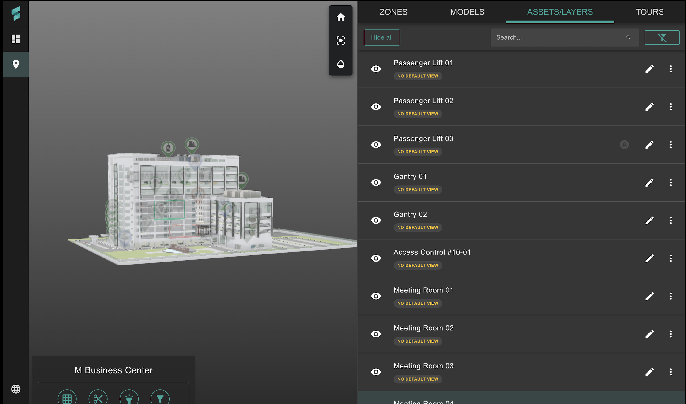

[![LinkedIn][linkedin-shield]][linkedin-url]

# Internship Experience at G Element

 
A short write up of my fullstack developer internship experience at G Element detailing the technologies I used, the tasks I worked on and more

  
Table Of Contents

  <ol>
    <li>
      <a href="#about-the-company">About The Company</a>
    </li>
    <li>
      <a href="#technologies-and-tools-i-used">Technologies I Used</a>
    </li>
    <li>
      <a href="#tasks-i-worked-on">Tasks I Worked On</a>
    </li>
    <li>
      <a href="#practices">Practices</a>
    </li>
  </ol>

## About the company

  

 

  Headquartered in Singapore and operating across the APAC region, G Element is a regional, award-winning tech company providing digital twin solutions that make buildings and cities smart, autonomous and sustainable.

  Their main product is an award-winning digital twin platform <a href="https://www.senfi.io/main/">Senfi</a> that combines 3D BIM data, artificial intelligence, robotics and real-time sensor data to continually provide building managers with full insights into their buildings/cities.

  Read more about the company <a href="https://www.gelement.com/company/our-profile/">here</a>

## Technologies and Tools I Used

[![Vue][Vue.js]][Vue-url]
[![Node][Node.js]][Node-url]
[![Express][Express.js]][Express-url]
[![Postgres][Postgres]][Postgres-url]

## Tasks I Worked On

### Development of a 3D Building and Site Configurator

<strong>Description:</strong> I was tasked to develop a 3D building and site configurator that enabled users to seamlessly model 3D buildings and configure various 3D assets, providing a more dynamic platform for real-time customization. This project replaced the previous content management system, which required multiple reloads of 3D sites whenever a user was editing its properties, which was a significant issue for larger sites with thousands of 3D assets.

<strong>Technologies Used:</strong>

<ul>
    <li>Frontend: Vue.js, Quasar</li>
    <li>Backend: Node.js, Express.js</li>
</ul>

<strong>Outcome:</strong> By the end of my internship, I had integrated a single viewer for each site and allowed users to configure their 3D assets without having to reload each time, significantly reducing load times and enhancing user experience. This integration streamlined the process, allowing for real-time updates and configurations, which greatly improved the system's efficiency and user satisfaction, enhancing building managers' ability to respond to real-time events.

    
    
<em>Screenshot of the 3D Building and Site Configurator</em>

#### Before and After Integration:

    
    
<em>Before Integration</em>

    
    
<em>After Integration</em>

### API Development and Integration

<strong>Description:</strong> As part of my work on the 3D site configurator, I was tasked with adding API endpoints to their external APIs to provide a more robust set of endpoints, as the previous projects each used their own internal APIs and the external APIs were quite limited.

<strong>Technologies Used:</strong>

<ul>
    <li>Backend: Node.js, Express.js</li>
    <li>Database: PostgreSQL</li>
    <li>Tools: Postman for API testing</li>
</ul>

<strong>Outcome:</strong> I designed and created RESTful APIs using Node.js, Express.js, and PostgreSQL, utilizing the <a href="https://www.npmjs.com/package/joi">Joi</a> library for validation checking. This ensured data integrity and seamless integration with the frontend. This enhancement made the APIs much more versatile and significantly increased developer productivity.

## Practices

<strong>Version Control:</strong> I used Git for version control, collaborating with a team of five developers.

<strong>CI/CD:</strong> Followed an established Continuous Integration/Continuous Deployment (CI/CD) pipeline. This automated the testing and deployment processes, ensuring that my code was always in a deployable state.

<strong>Code Documentation:</strong> I thoroughly documented my code using inline comments, markdown files, and API documentation tools to make it easy for others to understand and maintain.

    
    
<em>Example communication diagram for viewer and asset editor flow</em>

<!-- MARKDOWN LINKS & IMAGES -->

[linkedin-shield]: https://img.shields.io/badge/LinkedIn-0077B5?style=for-the-badge&logo=linkedin&logoColor=white
[linkedin-url]: https://www.linkedin.com/in/mattisong
[GElement-logo]: https://media.licdn.com/dms/image/C510BAQFD6MBQJv6hXQ/company-logo_200_200/0/1630609389310/g_element_pte_ltd_logo?e=1729123200&v=beta&t=9_jPr2U_SjA2ujkiXlxG84Y8VCra_r0hyoA_sZf9_qY
[GElement-url]: https://www.gelement.com/company/our-profile/
[Senfi-url]: https://www.senfi.io/main/
[Node.js]: https://img.shields.io/badge/node.js-6DA55F?style=for-the-badge&logo=node.js&logoColor=white
[Node-url]: https://nodejs.org/en
[Vue.js]: https://img.shields.io/badge/Vue.js-35495E?style=for-the-badge&logo=vuedotjs&logoColor=4FC08D
[Vue-url]: https://vuejs.org/
[Express.js]: https://img.shields.io/badge/express.js-%23404d59.svg?style=for-the-badge&logo=express&logoColor=%2361DAFB
[Express-url]: https://expressjs.com/
[Postgres]: https://img.shields.io/badge/postgres-%23316192.svg?style=for-the-badge&logo=postgresql&logoColor=white
[Postgres-url]: https://www.postgresql.org/
